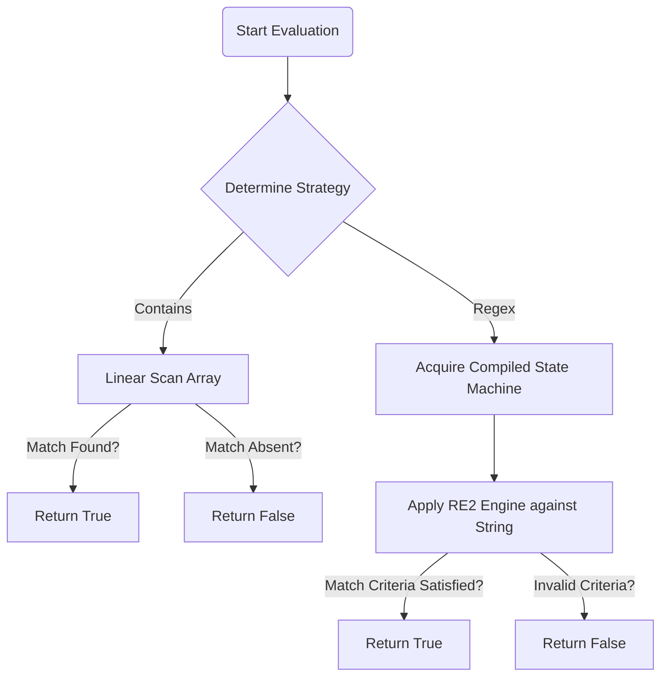

# Explicit Algorithm Specifications

This document defines the computational strategies and algorithmic complexities of the fundamental routines operating within the NetSentry engine. The algorithms strictly minimize temporal and spatial complexity traversing unstructured operational strings.

## Extrinsic Policy Match Evaluation Models

The `Matcher` interface dictates four fundamental mechanisms for evaluating configuration directives against the provided abstract syntax objects.

### 1. Sequential Substring Assessment (`contains` / `not_contains`)

**Computational Complexity**: Worst-case execution timeframe resolves to $O(N \cdot M)$, where $N$ constitutes the cumulative byte length of the overarching configuration payload arrays and $M$ specifies the targeted substring length sequence. Expected execution operates optimally utilizing the Boyer-Moore string-search heuristics implemented natively in Go.

**Execution Strategy**: 
1. The subroutines execute unidirectional scans across the pre-tokenized configuration arrays.
2. The logic terminates execution instantly upon registering a deterministic boundary constraint equivalent to true.
3. For inverted tests (`not_contains`), comprehensive scanning sequences encompassing the full configuration payload array are mandatory determining absolute exclusion logic.

### 2. Regular Expression Structural Evaluation (`regex`)

**Computational Complexity**: Evaluation velocity depends inherently entirely upon the intrinsic regex syntactic construct formulated. Time complexity constitutes sequential constant time $O(1)$ during compiler initialization directly preceding runtime linear $O(N)$ execution metrics mapping targeted payload structures.

**Execution Strategy**: 
1. The validation orchestrator strictly forces initialization of regular expressions through standard `regexp.CompilePOSIX` architectures specifically avoiding exponential backtracking algorithms exposing potential Denial-of-Service vectors. 
2. Compiled matrices operate sequentially evaluating tokenized character sets.

### Algorithmic Flow for the Match Execution Path



## Concurrent Execution Architecture Strategy

The policy evaluation limits execute via bounded worker channels preventing unchecked memory initialization routines mitigating `Out-Of-Memory` faults entirely during operations processing heavily weighted payloads.

### Deterministic Subroutine Topology

1.  **Job Pipeline**: An asynchronous unbuffered `chan policy.Rule` constructed exactly matching the overarching capacity matrix of the active definition logic.
2.  **Aggregation Processing**: A mutually active `chan policy.ValidationResult` collecting asynchronous response structures.
3.  **Goroutine Dispatch**: An instantiation metric limiting total parallel computing blocks explicitly defined by user preference metrics.

### Parallel Execution Methodology

```
Algorithm Validate(Config, Policy, ConcurrencyLevel)
  Allocate jobsChannel (capacity: |Rules|)
  Allocate resultsChannel (capacity: |Rules|)
  Initialize WaitGroup (count: ConcurrencyLevel)

  For i = 1 to ConcurrencyLevel do
      Spawn WorkerProcess(jobsChannel, resultsChannel)
  
  For each rule in Policy.Rules do
      Dispatch rule to jobsChannel
  
  Close jobsChannel
  Wait for WaitGroup completion
  Close resultsChannel
  
  Return AggregatedResults
```

## Topological Integrity Inference Analysis

The core application generates structural adjacency networks dynamically, assessing potential looping algorithms inherently defined exclusively through local routing assignments spanning multiple disparate entities.

### Unreachable Loop Identification via Depth-First Search (DFS)

To automatically uncover cyclical architectural structures preventing routing progression, the platform conducts recursive DFS trajectory analysis tracing physical edge relationships globally.

**Algorithm Mechanism Detail**:

1. Establish internal status tracking definitions representing categorical node boundaries (`Unvisited = 0`, `Processing = 1`, `Complete = 2`).
2. Iterative array looping captures universal unassigned starting nodes continuously.
3. Execution invokes a recursive call tree generating trajectory path limits representing physical network connectivity flows dynamically.
4. Active nodes convert toward `Processing` attributes indicating specific traversal involvement limits.
5. If recursion logic subsequently visits interconnected paths targeting pre-existing `Processing` attributes, the system correctly identifies closed-loop vectors triggering explicit validation failures automatically.
6. Exhausted path computations flip statuses determining final `Complete` boundaries, terminating active computational loops cleanly.

**Algorithmic Complexity**: Definitive linear computation constraint mapping universally equal $O(|V| + |E|)$ structures, reflecting vertex enumerations combining corresponding structural edge definitions globally.

## Differential Cryptographic State Calculation

Drift algorithms explicitly compute the comparative deviations bounding temporal snapshots against authoritative declarative base architectures using symmetric token computations rather than strict standard lexical patching engines to better capture logic structures instead of pure text syntax layout modifications.

### Drift Computation Model

1. **State Sanitization**: Non-contextual carriage boundaries, empty operational sequences, and insignificant metadata variables undergo deletion loops automatically ensuring only core syntax commands execute structurally.
2. **Deterministic Token Arrays**: Base variables process toward explicit sequential structure mappings via arrays directly.
3. **Discrepancy Formula Execution**: 
   The calculation applies the metric percentage logic deriving exactly specific structural shifts globally defining significant change modifiers bounding defined thresholds.
   $$ \Delta_{score} = \left( \frac{ \text{Added_Lines} + \text{Removed_Lines} }{ \text{Total_Baseline_Lines} } \right) \times 100 $$
