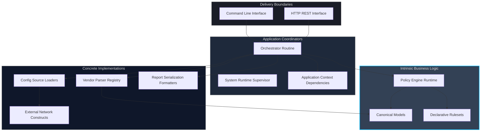
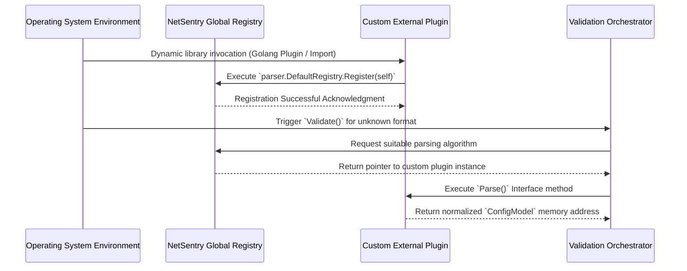

# Architectural Design and Component Interaction

This document delineates the architectural principles, component separation, dependency boundaries, and systematic flow governing the NetSentry application. Implementations exclusively rely upon Clean Architecture frameworks, enforcing absolute independence between the core domain structures and edge-bound infrastructure constraints.

## Clean Architecture Principles

NetSentry strictly isolates infrastructure concerns from core business logic. Dependencies unequivocally point inwards; defining domain entities remain entirely decoupled from external networking frameworks, persistence layers, and end-user delivery mechanisms.

### Delivery Layer

Located within `cmd/netsentry/` and `internal/api/`, the Delivery Layer interprets incoming user intentions (either through CLI argument parsing or HTTP REST parameter decoding), translates requests into normalized validation configurations, and coordinates with internal components. This layer must remain devoid of core computational logic.

### Application Layer

Located within `internal/app/`, the orchestrator subroutines coordinate the sequence of operations. This bridges input collection, config loading, semantic analysis, and policy validation engine interactions. The `app.Context` registers all dependencies seamlessly, ensuring inversion of control.

### Domain Layer

Located within `internal/model/` and `internal/policy/`, this layer defines structured `ConfigModel`, canonical device paradigms (`ACL`, `Interface`, `OSPF`), and the declarative Policy configurations. It also houses the deterministic `evaluation` engine driving multi-threaded validation execution.

### Infrastructure Layer

Located across `internal/parser/`, `internal/config/`, `internal/report/`, this layer physically acts upon the system environment, reading disk objects, opening SSH streams to hardware platforms, projecting terminal-based character reports, or parsing raw syntax via heuristic analyzers.

## System Topology and Interconnectivity

The following architectural graph represents the strict directional dependencies executed during the core validation pipeline.

## Data Validation Workflow

The primary operational mode of NetSentry invokes the progressive transformation of unstructured character sequences into verified structural compliance outputs.

1.  **Ingestion Request**: A trigger invokes `Validate()`. The system issues network or disk read operations acquiring arbitrary configuration strings.
2.  **Detection Signature Heuristics**: Raw inputs are processed against regex signatures mapped to respective hardware vendors (e.g., `^boot-start-marker` signals Cisco IOS).
3.  **Parsing Transformation**: Specialized tokenizers dismantle syntactic vendor commands, converting strings like `ip route 0.0.0.0 0.0.0.0 10.0.0.1` into the canonical `model.RoutingEntry{}` structure.
4.  **Policy Assimilation**: The requested declarative YAML object receives comprehensive structural validation via `gopkg.in/yaml.v3`, transposing rules, severity integers, and criteria strategies into the memory model.
5.  **Multi-threaded Substring Execution**: The runtime supervisor isolates individual policy criteria, maps them into validation jobs, and feeds an asynchronous worker pool performing regex combinations and string containment metrics.
6.  **Mathematical Aggregation**: Executed tasks populate an asynchronous results channel. A collecting routine applies failure weighting limits, tabulates percentages, and calculates the summary boolean state based on enforced strictness constraints.

## Plugin Extensibility Pattern

To expand functionalities absent core-level modification, plugins may be injected at runtime.

