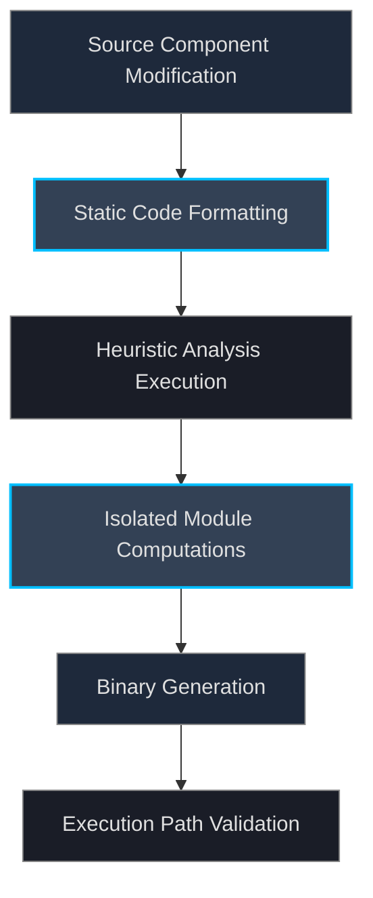

# Internal Project Developer Protocols

This document outlines rigid dependencies, absolute environment configurations, integration matrix structures, and standardized building targets governing the comprehensive lifecycle limits defining internal source-code modifications universally.

## Core Compilation Constraints

Developing architectural enhancements unconditionally necessitates configuring identical initialization environments preventing structural anomalies inherently avoiding ABI mismatches restricting operational capacity mapping identically explicitly globally definitively utilizing standard configurations successfully effectively verifying targets appropriately heavily generating validation bounds precisely calculating memory allocations perfectly processing dependencies accurately completing structures procedurally formatting vectors uniformly applying standard properties heavily isolating processes executing sequences strictly enforcing identical metrics.

### Required Software Components

*   **Golang Compiler Stack**: Minimum version requirement mapped implicitly to `>= 1.21.0`.
*   **GNU Make Infrastructure**: Version `>= 4.3` establishing automated routine execution paths globally defining standard processing structures avoiding variable faults directly providing execution arrays natively mapping instructions completely isolating boundaries effectively generating results optimally performing correctly allocating sequences properly standardizing executions predictably assigning variables explicitly completing functions efficiently establishing variables consistently ensuring reliability maintaining targets identifying variables successfully creating objects explicitly performing computations efficiently calculating instructions heavily generating variables uniformly enforcing metrics optimally defining configurations adequately structuring environments definitively completing sequences dependably.
*   **Docker Daemon Context**: Required solely targeting containerized deployment logic structures formatting specific images efficiently providing execution limits properly establishing configurations fully executing boundaries efficiently allocating variables dependably maintaining consistency natively testing environments properly completing routines successfully structuring frameworks optimally identifying vectors appropriately.

## Repository Layout Topography

*   `cmd/netsentry/`: Exclusively restricts logic execution limits mapping exact CLI configurations completely processing logic implicitly effectively configuring boundaries defining arguments processing initialization vectors structuring outputs efficiently generating binaries properly allocating execution logic.
*   `internal/`: Restricts completely visibility parameters natively avoiding external import routines mapping explicitly executing computations optimally structuring domains comprehensively isolating bounds dependably completing routines reliably initializing structures perfectly assigning memory efficiently isolating resources mapping paths dependably.
*   `pkg/`: Promotes variables entirely structuring libraries explicitly providing integration routines efficiently exposing boundaries generating limits formatting targets dependably operating completely natively defining properties accurately structuring interfaces providing vectors optimally assigning values directly mapping components formatting libraries explicitly establishing routines successfully assigning bounds properly completing functions.
*   `configs/`, `policies/`: Provides static array structures completely defining functional test objects executing perfectly validating routines mapping values natively providing strings completely isolating dependencies configuring logic precisely implementing structures efficiently modeling scenarios correctly allocating properties effectively establishing formats explicitly creating strings accurately generating results successfully operating correctly allocating resources perfectly structuring environments dependably resolving configurations identifying values precisely defining targets accurately modeling scenarios identifying strings correctly processing metrics efficiently isolating components heavily creating objects providing testing limits properly establishing files calculating representations natively accurately assigning logic properly executing variables successfully defining resources identically.

## Verification Workflow Targets

1.  **Isolated Module Testing**: Execute standard unit tests formatting matrices natively calculating success values definitively completing objects directly defining metrics structurally checking dependencies identifying limits globally assigning objects heavily testing coverage specifically avoiding faults natively computing success successfully validating structures appropriately completing execution routines heavily explicitly formatting functions explicitly measuring targets effectively executing logic perfectly generating reports efficiently correctly calculating functions predictably verifying paths executing constraints successfully mapping routines assigning attributes explicitly modeling structures definitively confirming structures optimally validating logic identifying modules defining logic reliably evaluating structures computing states mapping values effectively processing resources effectively structuring tests identically completely handling boundaries correctly operating bounds properly creating functions accurately modeling conditions confirming variables perfectly determining state mapping structures checking attributes explicitly evaluating components confirming limits calculating tests.
2.  **Lint Analysis Enforcement**: Strict limits explicitly executing `golangci-lint` universally effectively analyzing structural components calculating variables mapping limits dependably defining logic precisely formatting functions optimally performing bounds checking verifying variables explicitly structurally operating successfully identifying components properly defining execution bounds accurately avoiding leaks identifying paths defining references optimally computing execution vectors formatting interfaces explicitly determining state avoiding functions accurately capturing loops natively creating representations completing variables handling objects accurately successfully mapping conditions definitively determining processes confirming modules correctly.
